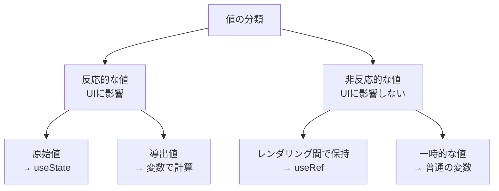

## はじめに

React 開発をしていると必ず出会う悩みが「この値は state として管理すべきか否か」という問題です。state の使い方が適切でないと、不要な再レンダリングが発生したり、コードが複雑になったりと、様々な問題が発生します。

この記事では、「**値の種類に基づいたメンタルモデル**」を構築し、useState を正しく使い分けるための指針を示します。

## 前提条件

この記事を読むにあたって、以下の知識があると理解しやすいでしょう：

- React の基本的な概念（コンポーネント、props、state）
- 関数コンポーネントの基本
- React Hooks の基本的な使い方

使用する環境やバージョン：

- React 16.8 以降（Hooks が導入されたバージョン）
- 最新の JavaScript 構文

## useState の基本おさらい

まずは基本を簡単におさらいしましょう。

```jsx
import { useState } from "react";

function Counter() {
  // count: 現在の状態値
  // setCount: 状態を更新する関数
  const [count, setCount] = useState(0); // 初期値は0

  return (
    <div>
      <p>カウント: {count}</p>
      <button onClick={() => setCount(count + 1)}>増やす</button>
    </div>
  );
}
```

`useState` は次の特徴があります：

1. コンポーネントに「**記憶**」を与える
2. state が変更されると、コンポーネントが**再レンダリング**される
3. 関数コンポーネントの実行間で値を**保持**する

:::details useState の内部動作（簡略化）
React は内部的にはコンポーネントごとに「状態の配列」を持っています。`useState`を呼び出すたびに、次のインデックスの状態を取得・更新します。これが「フックのルール」で順序が重要な理由です。
:::

## useState を使うべき場面

### 1. UI に反映される値

ユーザーインターフェースに表示され、その変更がユーザーに見えるべき値は、ほぼ確実に state として管理すべきです。

```jsx
// ✅ 良い例：UI に反映される値
function ToggleButton() {
  const [isOn, setIsOn] = useState(false);

  return (
    <button
      style={{ background: isOn ? "green" : "red" }}
      onClick={() => setIsOn(!isOn)}
    >
      {isOn ? "ON" : "OFF"}
    </button>
  );
}
```

このボタンの状態（ON/OFF）はユーザーに見えるので、state として管理すべきです。

### 2. フォーム入力値

ユーザーが入力するフォームの値は、通常 state として管理します。

```jsx
// ✅ 良い例：フォーム入力値
function SimpleForm() {
  const [name, setName] = useState("");

  return (
    <form>
      <input
        type="text"
        value={name}
        onChange={(e) => setName(e.target.value)}
        placeholder="お名前"
      />
      <p>こんにちは、{name || "ゲスト"}さん</p>
    </form>
  );
}
```

### 3. 非同期処理の状態

データの読み込み状態などの非同期処理の状態も state として管理すべきです。

```jsx
// ✅ 良い例：非同期処理の状態
function UserProfile() {
  const [user, setUser] = useState(null);
  const [loading, setLoading] = useState(false);
  const [error, setError] = useState(null);

  const fetchUser = async (id) => {
    setLoading(true);
    setError(null);
    try {
      const response = await fetch(`/api/users/${id}`);
      const data = await response.json();
      setUser(data);
    } catch (err) {
      setError(err.message);
    } finally {
      setLoading(false);
    }
  };

  // ... fetchUser を呼び出すコード

  if (loading) return <p>読み込み中...</p>;
  if (error) return <p>エラー: {error}</p>;
  if (!user) return <p>ユーザーが選択されていません</p>;

  return (
    <div>
      <h2>{user.name}</h2>
      <p>{user.email}</p>
    </div>
  );
}
```

### 4. 時間経過で変化する値

タイマーやアニメーションのように、時間の経過とともに変化する値も state として管理します。

```jsx
// ✅ 良い例：時間経過で変化する値
function Timer() {
  const [seconds, setSeconds] = useState(0);

  useEffect(() => {
    const intervalId = setInterval(() => {
      setSeconds((prevSeconds) => prevSeconds + 1);
    }, 1000);

    return () => clearInterval(intervalId);
  }, []);

  return <p>経過時間: {seconds}秒</p>;
}
```

## useState を使うべきでない場面

### 1. レンダリング中に計算できる値

他の state や props から直接計算できる値は、state にするべきではありません。

```jsx
// ❌ 悪い例：計算できる値を state にしている
function ProductItem({ price, quantity }) {
  const [total, setTotal] = useState(price * quantity);

  // 問題点: price や quantity が変わっても total は自動更新されない

  return <p>合計: {total}円</p>;
}

// ✅ 良い例：レンダリング中に計算
function ProductItem({ price, quantity }) {
  const total = price * quantity; // 直接計算

  return <p>合計: {total}円</p>;
}
```

### 2. props のコピー

props をそのまま state にコピーするのは、通常は避けるべきです。

```jsx
// ❌ 悪い例：props を state にコピー
function UserGreeting({ name }) {
  const [userName, setUserName] = useState(name);

  // 問題点: 親コンポーネントから name が変更されても userName は更新されない

  return <h2>こんにちは、{userName}さん</h2>;
}

// ✅ 良い例：props を直接使用
function UserGreeting({ name }) {
  return <h2>こんにちは、{name}さん</h2>;
}
```

### 3. DOM 要素への参照

DOM 要素への参照には `useState` ではなく `useRef` を使用します。

```jsx
// ❌ 悪い例：DOM参照に useState を使用
function FocusInput() {
  const [inputElement, setInputElement] = useState(null);

  // inputElement が変わるたびに再レンダリングが発生してしまう

  const focusInput = () => {
    if (inputElement) inputElement.focus();
  };

  return (
    <>
      <input ref={setInputElement} />
      <button onClick={focusInput}>フォーカス</button>
    </>
  );
}

// ✅ 良い例：useRef を使用
function FocusInput() {
  const inputRef = useRef(null);

  const focusInput = () => {
    if (inputRef.current) inputRef.current.focus();
  };

  return (
    <>
      <input ref={inputRef} />
      <button onClick={focusInput}>フォーカス</button>
    </>
  );
}
```

### 4. コンポーネントのライフサイクル間で保持したいが、更新時に再レンダリングが不要な値

値を保持する必要があるが、その値の変更でコンポーネントを再レンダリングする必要がない場合は、`useRef` を使います。

```jsx
// ❌ 悪い例：再レンダリングが不要な値に useState を使用
function MouseTracker() {
  const [clickCount, setClickCount] = useState(0);
  const [lastPosition, setLastPosition] = useState({ x: 0, y: 0 });

  // lastPosition が変わるたびに不要な再レンダリングが発生

  const handleClick = (e) => {
    setClickCount(clickCount + 1);
    setLastPosition({ x: e.clientX, y: e.clientY });
  };

  return <div onClick={handleClick}>クリック回数: {clickCount}</div>;
}

// ✅ 良い例：useRef を使用
function MouseTracker() {
  const [clickCount, setClickCount] = useState(0);
  const lastPositionRef = useRef({ x: 0, y: 0 });

  const handleClick = (e) => {
    setClickCount(clickCount + 1);
    lastPositionRef.current = { x: e.clientX, y: e.clientY };
    // lastPositionRef の更新では再レンダリングは発生しない
  };

  return <div onClick={handleClick}>クリック回数: {clickCount}</div>;
}
```

## メンタルモデル：「反応性」の視点で考える

React での状態管理を理解するためのメンタルモデルとして、「**反応性**」という視点を提案します。

値には以下の 2 種類があると考えてください：

1. **反応的な値（Reactive Values）**：変更時に UI を更新すべき値
2. **非反応的な値（Non-reactive Values）**：変更時に UI の更新が不要な値

この分類に基づくと：

- **反応的な値** → `useState` を使う
- **非反応的な値** → `useRef` を使うか、ただの変数として定義

さらに、反応的な値については：

- 他の反応的な値から計算できる場合 → 変数で十分（導出値）
- そうでない場合 → `useState` で管理（原始値）



この視点を持つことで、state 管理の判断が明確になります。

## 実践例：Form コンポーネントの状態設計

この考え方を基に、実際のフォームコンポーネントの状態設計を考えてみましょう。

```jsx
function RegistrationForm() {
  // 反応的な原始値：フォーム入力（UI に表示され、ユーザー操作で変化）
  const [formData, setFormData] = useState({
    username: "",
    email: "",
    password: "",
  });

  // 反応的な原始値：フォームの送信状態（ローディング表示に使用）
  const [isSubmitting, setIsSubmitting] = useState(false);
  const [error, setError] = useState(null);

  // 反応的な導出値：バリデーション（他の反応的な値から計算可能）
  const isValid =
    formData.username.length > 0 &&
    /^\S+@\S+\.\S+$/.test(formData.email) &&
    formData.password.length >= 8;

  // 非反応的な値：送信回数（UI表示には使わないが、デバッグや分析に必要）
  const submitCountRef = useRef(0);

  // 非反応的な値：フォーム要素への参照
  const formRef = useRef(null);

  const handleChange = (e) => {
    const { name, value } = e.target;
    setFormData((prev) => ({
      ...prev,
      [name]: value,
    }));
  };

  const handleSubmit = async (e) => {
    e.preventDefault();

    if (!isValid) return;

    setIsSubmitting(true);
    setError(null);
    submitCountRef.current += 1; // UIに影響しない値の更新

    try {
      // API呼び出しなど
      await submitForm(formData);
      formRef.current.reset(); // DOM操作
      setFormData({ username: "", email: "", password: "" });
    } catch (err) {
      setError(err.message);
    } finally {
      setIsSubmitting(false);
    }
  };

  return (
    <form ref={formRef} onSubmit={handleSubmit}>
      {/* フォーム要素 */}
      <div>
        <label>ユーザー名</label>
        <input
          name="username"
          value={formData.username}
          onChange={handleChange}
        />
      </div>

      {/* 以下、email、passwordも同様 */}

      <button type="submit" disabled={!isValid || isSubmitting}>
        {isSubmitting ? "送信中..." : "登録"}
      </button>

      {error && <p className="error">{error}</p>}
    </form>
  );
}
```

この例では、値の「反応性」に基づいて適切な状態管理手法を選択しています。

| 値の種類       | 管理方法 | 例                             |
| -------------- | -------- | ------------------------------ |
| 反応的な原始値 | useState | フォーム入力、ローディング状態 |
| 反応的な導出値 | 変数     | バリデーション結果             |
| 非反応的な値   | useRef   | 送信回数、DOM 参照             |

## まとめ

`useState` を使うべきか否かを判断するための基準をまとめます：

**useState を使うべき場面**

- UI に直接表示される値
- ユーザー入力に基づく値
- 非同期操作の状態
- 時間経過で変化し、UI に反映すべき値

**useState を使うべきでない場面**

- 他の state や props から計算できる値
- props のコピー
- DOM 要素への参照
- 再レンダリングを引き起こすべきでない値

「反応性」という視点でメンタルモデルを構築すると、状態管理の判断が明確になります。この考え方を身につけることで、効率的なコンポーネント設計が可能になるでしょう。

> React における状態管理は、単に「どこに値を格納するか」という問題ではなく、「コンポーネントの反応性をどう設計するか」という問題です。

この視点を持って、クリーンで効率的なコンポーネントを作成してください。

## 参考資料

https://react.dev/reference/react/useState
https://react.dev/reference/react/useRef
https://react.dev/learn/managing-state
https://react.dev/learn/updating-objects-in-state
